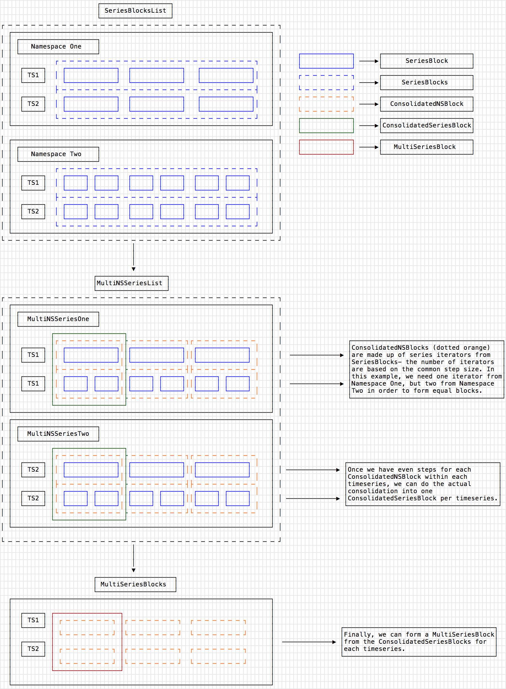

# Blocks

**Please note:** This documentation is a work in progress and more detail is required.

## Overview

The fundamental data structures that M3Coordinator uses are `Blocks`. `Blocks` are what get created from the series iterators that M3DB returns. A `Block` is associated with a start and end time. It contains data from multiple time series stored in columnar format.

Most transformations within M3Coordinator will be applied across different series for each time interval. Therefore, having data stored in columnar format helps with the memory locality of the data. Moreover, most transformations within M3Coordinator can work in parallel on different blocks which can significantly increase the computation speed.

## Diagram

Below is a visual representation of a set of `Blocks`. On top is the M3QL query that gets executed, and on the bottom, are the results of the query containing 3 different Blocks.

```
                              ┌───────────────────────────────────────────────────────────────────────┐
                              │                                                                       │
                              │     fetch name:sign_up city_id:{new_york,san_diego,toronto} ios:*     │
                              │                                                                       │
                              └───────────────────────────────────────────────────────────────────────┘
                                         │                        │                         │
                                         │                        │                         │
                                         │                        │                         │
                                         ▼                        ▼                         ▼
                                  ┌────────────┐            ┌────────────┐           ┌─────────────┐
                                  │  Block One │            │  Block Two │           │ Block Three │
                                  └────────────┘            └────────────┘           └─────────────┘
                              ┌──────┬──────┬──────┐    ┌──────┬──────┬──────┐   ┌──────┬──────┬──────┐
                              │   t  │ t+1  │ t+2  │    │  t+3 │ t+4  │ t+5  │   │  t+6 │ t+7  │ t+8  │
                              ├──────┼──────┼──────▶    ├──────┼──────┼──────▶   ├──────┼──────┼──────▶
┌───────────────────────────┐ │      │      │      │    │      │      │      │   │      │      │      │
│       name:sign_up        │ │      │      │      │    │      │      │      │   │      │      │      │
│  city_id:new_york os:ios  │ │  5   │  2   │  10  │    │  10  │  2   │  10  │   │  5   │  3   │  5   │
└───────────────────────────┘ │      │      │      │    │      │      │      │   │      │      │      │
                              ├──────┼──────┼──────▶    ├──────┼──────┼──────▶   ├──────┼──────┼──────▶
┌───────────────────────────┐ │      │      │      │    │      │      │      │   │      │      │      │
│       name:sign_up        │ │      │      │      │    │      │      │      │   │      │      │      │
│city_id:new_york os:android│ │  10  │  8   │  5   │    │  20  │  4   │  5   │   │  10  │  8   │  5   │
└───────────────────────────┘ │      │      │      │    │      │      │      │   │      │      │      │
                              ├──────┼──────┼──────▶    ├──────┼──────┼──────▶   ├──────┼──────┼──────▶
┌───────────────────────────┐ │      │      │      │    │      │      │      │   │      │      │      │
│       name:sign_up        │ │      │      │      │    │      │      │      │   │      │      │      │
│ city_id:san_diego os:ios  │ │  10  │  5   │  10  │    │  2   │  5   │  10  │   │  8   │  6   │  6   │
└───────────────────────────┘ │      │      │      │    │      │      │      │   │      │      │      │
                              ├──────┼──────┼──────▶    ├──────┼──────┼──────▶   ├──────┼──────┼──────▶
┌───────────────────────────┐ │      │      │      │    │      │      │      │   │      │      │      │
│       name:sign_up        │ │      │      │      │    │      │      │      │   │      │      │      │
│  city_id:toronto os:ios   │ │  2   │  5   │  10  │    │  2   │  5   │  10  │   │  2   │  5   │  10  │
└───────────────────────────┘ │      │      │      │    │      │      │      │   │      │      │      │
                              └──────┴──────┴──────┘    └──────┴──────┴──────┘   └──────┴──────┴──────┘
```

## M3DB => M3Coordinator Blocks

M3DB will return to M3Coordinator `SeriesBlocks` that contain a list of `SeriesIterators` for a given timeseries per namespace. We would convert that into a `ConslidatedBlockIterators` depending on the consolidation chosen. Each underlying `ConsolidatedBlockIterator` would have the same time duration. This means that the last block can span outside the `EndTime`. We would rely on the user of these blocks to perform the truncation.

From `ConslidatedBlockIterators` per series, we will construct a `MultiSeriesBlock` that will contain a slice of `ConslidatedBlockIterators` for a given block as well as a `Start` and `End`. `MultiSeriesBlock` aligns the different series to their LCM.

This struct will then be used in either a `CompressedStepIterator` or a `CompressedSeriesIterator` depending on if the block needs to iterate through the values vertically or horizontally. These two structs will satisfy the `StepIter` interface or `SeriesIter` interface, respectively, to return a slice of values vertically at each timestamp (step) or horizontally at each timeseries (series).

Below is a diagram of how this would look across multiple namespaces (i.e. different resolutions).


